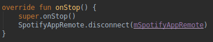

**Memória**

O uso da memória tem um certo pico na hora do GET da playlist da api do spotify. Mesmo criando várias salas e dando fetch em várias playlist, cada playlist quando destrói a sala ela é destruída, o que pode ser ruim para o uso de rede mas melhor pro uso da memória. Foi uma escolha ter mais uso de rede do que uso de memória.Paramos o serviço do spotify no onDestroy() do RoomPlayer.kt para não haver memleak.

